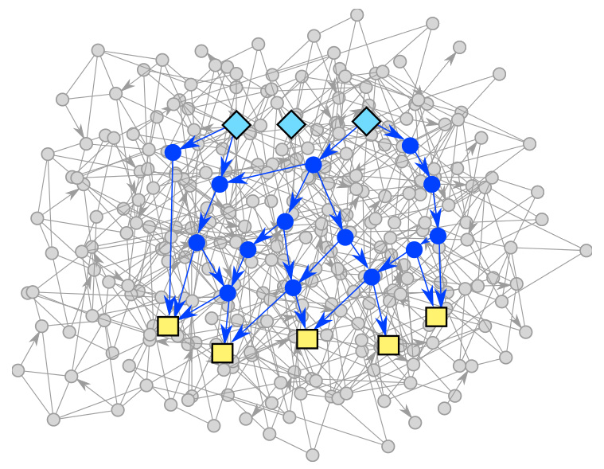

# PathLinker

This software implements the PathLinker algorithm for reconstructing
signaling pathways from protein interaction networks.

### Authors
  * Christopher L. Poirel (chris.poirel@gmail.com)
  * Anna Ritz (annaritz@vt.edu)
  * Nicholas Sharp (nsharp3@vt.edu)
  * T. M. Murali (tmmurali@cs.vt.edu) [**corresponding author**]

### Overview 

  PathLinker is a method for reconstructing signaling pathways from
  protein interaction and regulatory networks. Consider a protein-protein interaction
  network represented as a directed graph. The network may
  contain physical, signaling, and regulatory interactions between pairs
  of proteins. Given a query composed of a set of receptors and a set of
  transcription factors in this network that represent the "sources" and
  "targets" of some specific signaling pathway (e.g., the Wnt pathway),
  PathLinker attemps to compute a high quality reconstruction of this
  pathway. Specifically, PathLinker computes a subnetwork that connects
  the receptors in the query to the transcription factors in the query.
  In its output, PathLinker ranks the interactions in the network with
  respect to the query, as described below.

The primary algorithmic component of PathLinker is computing the 
*k*-shortest simple paths in the network from any receptor to any
transcription factor. PathLinker accomplishes this task through a novel integration of 
Yen's algorithm with the A* heuristic, which allows very efficient computation for very large *k* 
values, e.g., 10,000, on networks with hundreds of thousands of edges. PathLinker ranks each interaction in the 
network by the index of the first path in which it appears.

PathLinker supports several different options for weighting the network.
If the input graph has weights, PathLinker interprets them as multiplicative
probabilities by default, defines the cost of a path as the product of the weights of the edges in it, and computes the most probable paths by using a log-transform. The software supports a flag to interpret edge weights as additive
costs instead. If the input graph does not have weights, PathLinker can
run the PageRank algorithm as a pre-processing step to generate probablistic weights
from edges visitation probabilities.

See the publications referenced below for a formal description of the
method.

### What's included
  * **PathLinker.py** An end-to-end implementation of the PathLinker
  algorithm. Given a network, a set or receptors, a set of
  transcription factors, and a value of *k*, PathLinker outputs a ranked list of edges composing the *k* highest scoring paths connecting any receptor to any transcription factor.
  * **PageRank.py** An implementation of the PageRank algorithm. This algorithm can be used as
  a component of PathLinker, but it can also be run as a standalone tool.
  Given a weighted, directed network, PageRank uses the power method to compute the
  stationary node visitation probabilities after a teleporting random walk, i.e., a random walk with restarts. 
  * **ksp_Astar.py** An implementation of Yen's *k*-shortest simple
  paths algorithm augmented to use the A\* algorithm for additional
  speedup. Used as a component of PathLinker, but can also be run as a
  standalone tool.  Given a weighted, directed network, the algorithm
  computes the *k* shortest simple paths betwen a source and target
  node. Here a path is *simple* if there are no repeated nodes in the
  path.

Run any of the programs with the --help option for full documentation.
The /example directory contains a sample usage of these programs.
For all input files, lines beginning with a hash (#)
    are considered to be comments and ignored.

### Dependencies 

Python packages:
  * NetworkX

Older releases of this code are valid in both Python 2 and Python 3. With this
current version, Python 2 compatability is not guaranteed, and some unit tests
fail under Python 2.

Paths of equal length may be returned and processed in a different order
according to your version of Python and NetworkX. The results should be
interpreted as equivalent, although the output is not textually identical.

### License

GNU GPLv3

### How to Cite PathLinker

We will be very glad to hear from you if you use PathLinker in your work. If you publish a paper that uses PathLinker, please cite

1. <a href="http://www.nature.com/articles/npjsba20162">Pathways on Demand: Automated Reconstruction of Human Signaling Networks</a>. Anna Ritz, Christopher L. Poirel, Allison N. Tegge, Nicholas Sharp, Allison Powell, Kelsey Simmons, Shiv D. Kale, and T. M. Murali. *npj Systems Biology and Applications*, 2, Article number 16002, 2016. 

2. <a href="http://www.ncbi.nlm.nih.gov/pubmed/23641868">Top-down network analysis to drive bottom-up modeling of physiological processes</a>. Christopher L. Poirel, Richard R. Rodrigues, Katherine C. Chen, John J. Tyson, and T. M. Murali. *Journal of Computational Biology*, 20(5), 409-418, 2013. 
  
We encourage experimentation with PathLinker. Please don't hesitate to contact us if you would like to collaborate! 
